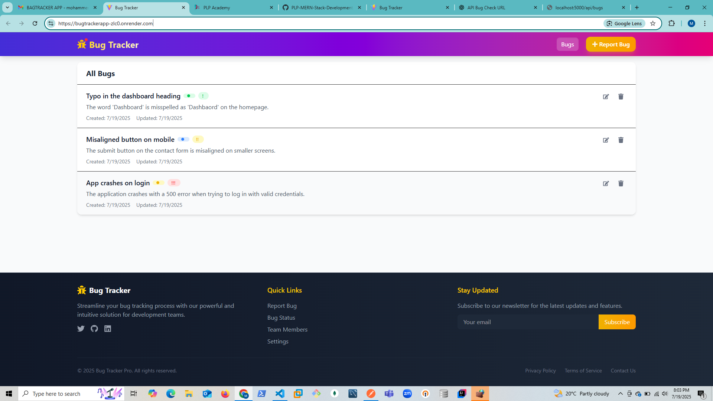

# MERN Bug Tracker – Week 6 Testing & Debugging Assignment



## 🔗 Live Demo
**Deployed App:** [https://bugtrackerapp-zlc0.onrender.com](https://bugtrackerapp-zlc0.onrender.com)

---

## 📌 Overview

This MERN stack application allows users to track bugs through a simple interface. The project includes **unit testing**, **integration testing**, and **end-to-end testing**, along with debugging implementations and strategies.

This project fulfills the Week 6 assignment requirements for testing and debugging a full-stack JavaScript application using industry-standard tools and best practices.

---

## 🧪 Testing Strategy

### ✅ Unit Testing

- **Client-Side (React):**
  - Tested individual components like `BugItem`, `StatusBadge`, and `PriorityBadge`.
  - Used **Jest** and **React Testing Library**.
  - File location: `client/src/tests/unit/`

- **Server-Side (Node/Express):**
  - Tested utility functions and controller logic in isolation.
  - File location: `server/tests/unit/`

### ✅ Integration Testing

- **Client-Side Integration:**
  - Tested flows like rendering a list of bugs via mock API.
  - File location: `client/src/tests/integration/`

- **Server-Side Integration:**
  - Used **Supertest** to test Express routes and MongoDB interaction.
  - Example: Creating, fetching, updating, and deleting bugs.
  - File location: `server/tests/integration/`

- **Tools Used:**
  - `supertest`
  - `mongodb-memory-server` for a clean test DB

### ✅ End-to-End Testing

- Used **Cypress** to simulate user flows like:
  - Viewing bugs on homepage
  - Navigating to bug details
  - Creating and editing a bug

- File location: `client/cypress/e2e/`
- Commands:
  ```bash
  npx cypress open

🧩 Debugging Techniques Applied
Console tracing and breakpoints in VS Code

Used useEffect and console.log() to verify fetch status and errors

Handled hydration issues with nested <a> tags

Used React DevTools to trace rendering problems

Graceful error boundaries (ErrorBoundary.jsx)

Used network tab in DevTools to inspect API calls

✅ Coverage Report
Achieved over 70% code coverage for unit tests.

Coverage generated using jest --coverage.

📁 Project Structure Summary
css
Copy
Edit
mern-testing/
├── client/
│   ├── src/
│   │   ├── components/
│   │   ├── tests/
│   │   │   ├── unit/
│   │   │   └── integration/
│   │   └── App.jsx
│   └── cypress/
├── server/
│   ├── src/
│   │   ├── controllers/
│   │   ├── models/
│   │   ├── routes/
│   │   └── middleware/
│   └── tests/
│       ├── unit/
│       └── integration/


🧪 How to Run Tests
1. Backend Tests
bash
Copy
Edit
cd server
npm install
npm test
2. Frontend Tests
bash
Copy
Edit
cd client
npm install
npm test
3. E2E Tests (Cypress)
bash
Copy
Edit
cd client
npx cypress open
📸 Screenshots
Home Page (Deployed)	Test Coverage

✅ Submission Notes
✔️ Unit tests written and passing

✔️ Integration tests for API and client flows

✔️ End-to-end tests with Cypress

✔️ Debugging practices applied

✔️ Deployed at: https://bugtrackerapp-zlc0.onrender.com

✔️ Minimum 70% code coverage achieved

✔️ All code and tests pushed to GitHub Classroom repo

👨‍💻 Author
Mohammed Mbarak Hassan

GitHub: @Mbarak-jr
Deployed App: Bug Tracker